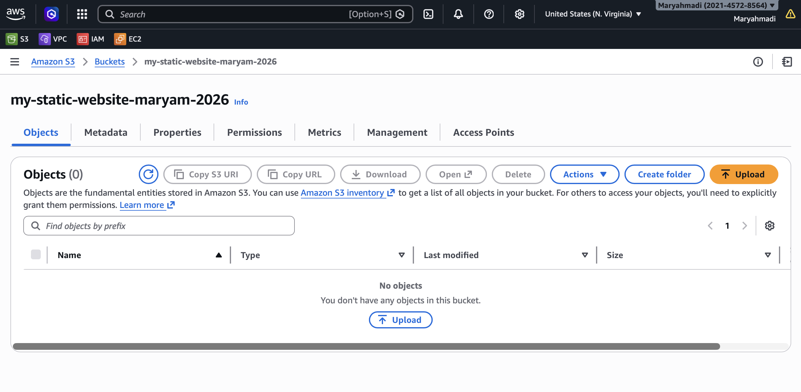
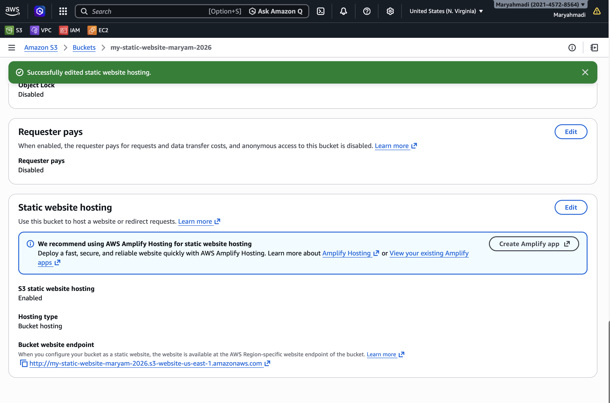
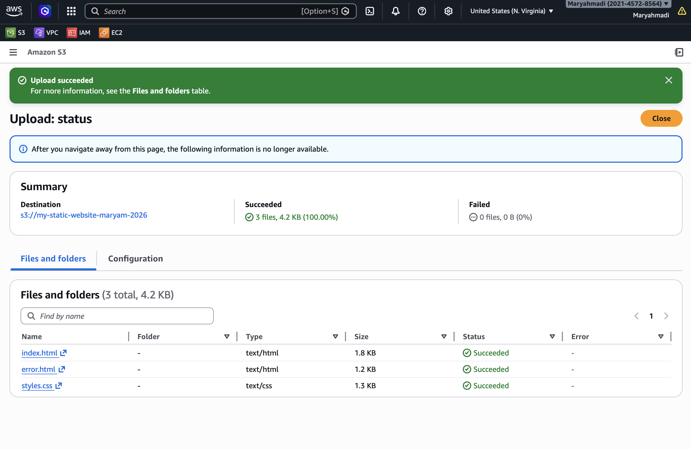
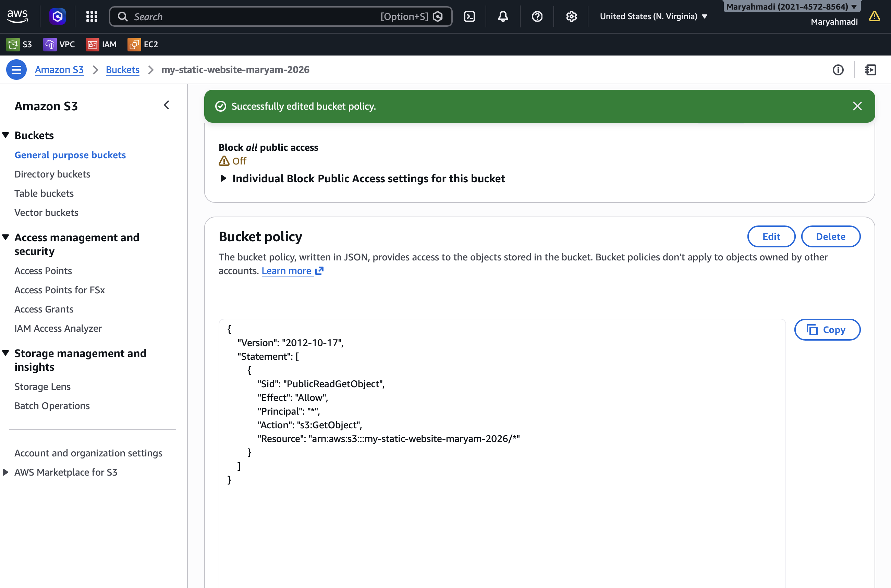
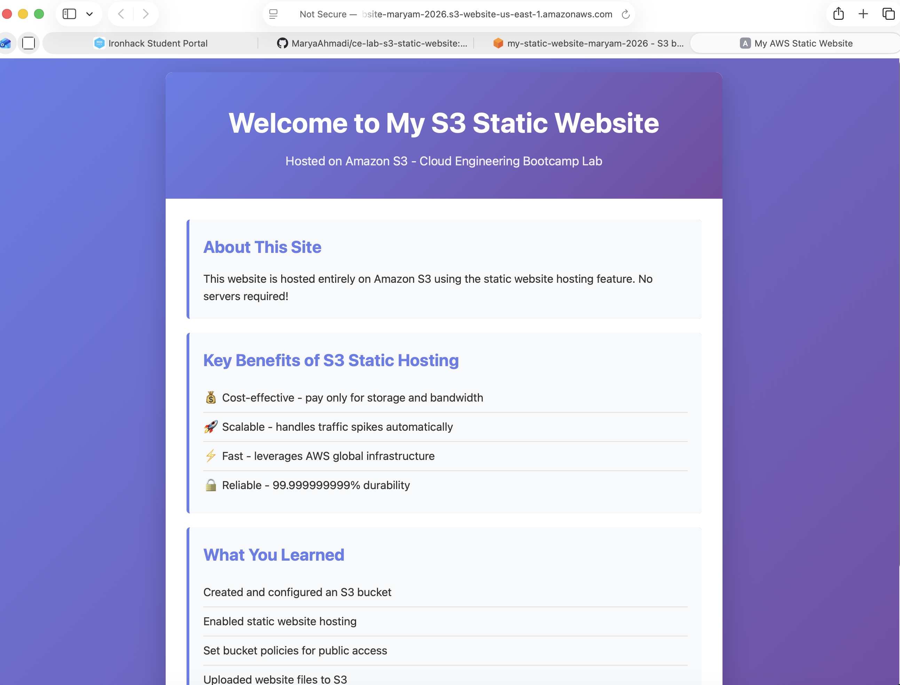
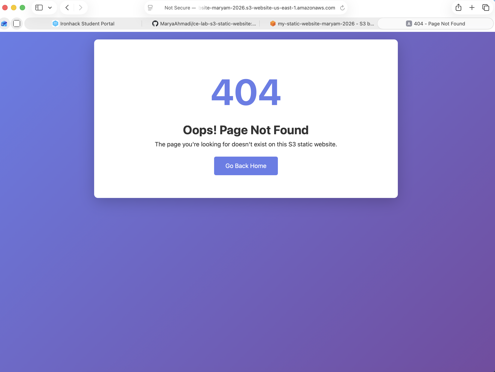

# Lab Solution: Host a Static Website on Amazon S3

**Student Name:** Maryam AHmadi  
**Date:** 2026-03-05  
**Lab Completion Time:** 120 minutes

---

## Part 1: Bucket Configuration

### Bucket Information

**Bucket Name:** my-static-website-maryam-2026

**Region:** us-east-1

**Bucket Website Endpoint URL:**
```
http://my-static-website-maryam-2026.s3-website-us-east-1.amazonaws.com/index.html
```

**Screenshot 1: Bucket Creation Confirmation**


---

## Part 2: Static Website Hosting Configuration

### Configuration Details

**Index Document:** 

<!DOCTYPE html>
<html lang="en">
<head>
    <meta charset="UTF-8">
    <meta name="viewport" content="width=device-width, initial-scale=1.0">
    <title>My AWS Static Website</title>
    <link rel="stylesheet" href="styles.css">
</head>

<body>

<div class="container">

<header>


<h1>Welcome to My S3 Static Website</h1>

<p class="subtitle">
Hosted on Amazon S3 - Cloud Engineering Bootcamp Lab
</p>

<nav>
<a href="index.html">Home</a> |
<a href="about.html">About Me</a>
</nav>

</header>

<main>

<section class="card">

<h2>About This Site</h2>

<p>
This website is hosted entirely on Amazon S3 using the static website hosting feature.
No servers required!
</p>

</section>

<section class="card">

<h2>Key Benefits of S3 Static Hosting</h2>

<ul>
<li>💰 Cost-effective - pay only for storage and bandwidth</li>
<li>🚀 Scalable - handles traffic spikes automatically</li>
<li>⚡ Fast - leverages AWS global infrastructure</li>
<li>🔒 Reliable - 99.999999999% durability</li>
</ul>

</section>

<section class="card">

<h2>What You Learned</h2>

<ul>
<li>Created and configured an S3 bucket</li>
<li>Enabled static website hosting</li>
<li>Set bucket policies for public access</li>
<li>Uploaded website files to S3</li>
<li>Accessed content via S3 endpoint</li>
</ul>

</section>

</main>

<footer>

<p>
Cloud Engineering Bootcamp © 2026 | Powered by Amazon S3
</p>

</footer>

</div>

</body>
</html>


**Error Document:** 

<!DOCTYPE html>
<html lang="en">
<head>
    <meta charset="UTF-8">
    <meta name="viewport" content="width=device-width, initial-scale=1.0">
    <title>404 - Page Not Found</title>
    <link rel="stylesheet" href="styles.css">
    <style>
        .error-container {
            text-align: center;
            padding: 60px 20px;
        }
        .error-code {
            font-size: 6em;
            color: #667eea;
            font-weight: bold;
        }
        .back-link {
            display: inline-block;
            margin-top: 20px;
            padding: 12px 30px;
            background: #667eea;
            color: white;
            text-decoration: none;
            border-radius: 5px;
            transition: background 0.3s;
        }
        .back-link:hover {
            background: #764ba2;
        }
    </style>
</head>
<body>
    <div class="container">
        <div class="error-container">
            <div class="error-code">404</div>
            <h1>Oops! Page Not Found</h1>
            <p>The page you're looking for doesn't exist on this S3 static website.</p>
            <a href="/" class="back-link">Go Back Home</a>
        </div>
    </div>
</body>
</html>


**Screenshot 2: Static Website Hosting Settings**


---

## Part 3: Website Files

### Files Created

List the files you created:
1. styles.css
2. index.html
3. error.html
4. about.html

**Did you customize the HTML/CSS?** (Yes/No): No

**If yes, describe your customizations:**
```
_____________________________________________________________
_____________________________________________________________
_____________________________________________________________
```

**Screenshot 3: Files Uploaded to S3**


---

## Part 4: Bucket Policy

### Bucket Policy Applied

**Paste your complete bucket policy here:**
{
    "Version": "2012-10-17",
    "Statement": [
        {
            "Sid": "PublicReadGetObject",
            "Effect": "Allow",
            "Principal": "*",
            "Action": "s3:GetObject",
            "Resource": "arn:aws:s3:::my-static-website-maryam-2026/*"
        }
    ]
}
```

**Screenshot 4: Bucket Policy Configuration**


---

## Part 5: Testing and Verification

### Website Testing

**Website URL (from endpoint):**
```
http://my-static-website-maryam-2026.s3-website-us-east-1.amazonaws.com/index.html
```

**Did the website load successfully?** (Yes/No): Yes

**Did the CSS styling apply correctly?** (Yes/No): Yes

**Screenshot 5: Working Website**


### Error Page Testing

**Test URL used:**
```
http://my-static-website-maryam-2026.s3-website-us-east-1.amazonaws.com/nonexistent.html

```

**Did custom error page display?** (Yes/No): No

**Screenshot 6: Custom 404 Error Page**


---

## Part 6: CLI Commands Used

**Document all AWS CLI commands you executed:**

```bash
# Bucket creation

aws s3 mb s3://my-static-website-maryam-2026   --region us-east-1

# Enable website hosting

aws s3 website s3://my-static-website-maryam-2026/ \
  --index-document index.html \
  --error-document error.html


# Upload files

cd ~/ce-lab-s3-static-website%
aws s3 cp index.html s3://my-static-website-maryam-2026/
aws s3 cp styles.css s3://my-static-website-maryam-2026/
aws s3 cp error.html s3://my-static-website-maryam-2026/

# Apply bucket policy

aws s3api put-bucket-policy \
  --bucket my-static-website-maryam-2026 \
  --policy file://bucket-policy.json


# Verify configuration or  Get website URL

aws s3api get-bucket-website --bucket my-static-website-maryam-2026
```

---

## Bonus Challenges Completed

- [ ok ] Challenge 1: Added about.html page
- [ ok ] Challenge 2: Used subdirectories for organization
- [ ok ] Challenge 3: Used `aws s3 sync` command

**Bonus Challenge Notes:**
```

The about.html page includes a short bio .
The Ironhack logo is uploaded in the header.
The project is fully synced to S3 using aws s3 sync ./website-files/ s3://my-static-website-maryam-2026/ --delete
The website is live and publicly accessible via the S3 endpoint.```

---

## Reflection Questions

### 1. What are the advantages of S3 static hosting compared to traditional web servers?

**Your answer:**
```
- Scalability: S3 automatically scales to handle any amount of traffic without needing manual server configuration.
- High availability and durability: Data is stored redundantly across multiple devices and facilities, ensuring reliability.
- Low maintenance: No server management, OS updates, or infrastructure is required.
- Cost-effective: You pay only for storage and bandwidth used, avoiding costs of running a dedicated server 24/7.
- Easy integration with other AWS services such as CloudFront for CDN, Route 53 for DNS, and Lambda for serverless logic.
```

### 2. Why is a bucket policy necessary for public website access?

**Your answer:**
```
- By default, S3 buckets are private. A bucket policy explicitly grants public read access to the files.
- Without a bucket policy, visitors cannot view or download your website content even if static hosting is enabled.
- It defines permissions securely and allows you to control which files or folders are publicly accessible.
- Ensures compliance with AWS security best practices by allowing scoped access instead of making the entire bucket world-readable by default.
```

### 3. What are the limitations of S3 static website hosting?

**Your answer:**
```
- Only static content is supported: HTML, CSS, JS, images – no server-side scripting like PHP or Python.
- Limited dynamic functionality: You cannot run traditional server-side databases or backend logic directly on S3.
- HTTPS is only available via CloudFront or a custom domain setup, not directly on the S3 endpoint.
- URL routing is basic: Only single-page redirects and custom error documents are supported.
- File size and request limits exist, so extremely large files or complex applications might require alternative hosting.```

### 4. When would you NOT use S3 for website hosting?

**Your answer:**
```
- When your website requires server-side processing (e.g., PHP, Python, Node.js backend).
- If your application needs a relational database hosted on the same server.
- For highly dynamic web apps that generate content per request on the server.
- If you need advanced user authentication and session management directly on the server.
- When you require HTTPS without using CloudFront or another CDN.

```

### 5. How does S3 static hosting fit into cost optimization strategies?

**Your answer:**
```
- You only pay for the storage used and the bandwidth consumed, avoiding fixed server costs.
- Eliminates the need for running and maintaining EC2 instances or other compute services for static sites.
- Integrates easily with CloudFront to reduce latency and bandwidth costs by caching content at edge locations.
- Supports lifecycle policies to automatically move older files to cheaper storage classes like S3 Glacier.
- Ideal for low-traffic or high-traffic static sites because costs scale linearly with usage, keeping expenses predictable.

```

---

## Troubleshooting Log

**Did you encounter any issues?** (Yes/No): ______

**If yes, document the issues and how you resolved them:**

|              Issue        |             Error Message        |                                  Solution                                  | Time  
|---------------------------|----------------------------------|----------------------------------------------------------------------------|
|    About page was blank   |Page showed empty content on click|                     with proper HTML and uploaded to S3|                   |5
|404 errors on removed files|Accessing old files returned 404  | Used aws s3 sync ./website-files/ s3://my-static-website-xyz-2026/ --delete|10                |    Logo not showing.      |.      Header logo missing        |           Uploaded logo image to S3 and updated file path in HTML.         |8              |


---

## Cleanup Confirmation

- [ ok ] Emptied S3 bucket
- [ ok ] Deleted S3 bucket
- [ ok ] Verified no resources remain

**Cleanup CLI commands used:**
```bash

# Empty bucket (delete all objects)
aws s3 rm s3://my-static-website-maryam-2026/ --recursive

# Delete bucket
aws s3 rb s3://my-static-website-maryam-2026/


```

---

## Self-Assessment

**Rate your understanding of each concept (1-5, where 5 is expert):**

| Concept | Rating | Notes |
|---------|--------|-------|
| S3 bucket creation | ___/5 | |
| Static website hosting configuration | __5_/5 | |
| Bucket policies and public access | __5_/5 | |
| Uploading and managing S3 objects | __5_/5 | |
| S3 website endpoints | __5_/5 | |
| HTML/CSS basics | _5__/5 | |

---

## Instructor Verification

**Instructor Name:** ___________________________

**Date Reviewed:** ___________________________

**Website URL Verified:** ☐ Yes ☐ No

**Comments:**
```
_____________________________________________________________
_____________________________________________________________
_____________________________________________________________
```

**Grade/Status:** ___________________________

---

## Additional Resources Referenced

List any documentation, tutorials, or resources you used:

1. ___________________________________________________________
2. ___________________________________________________________
3. ___________________________________________________________

---

**Lab Status:** ☐ Complete ☐ Needs Revision

**Total Time Spent:** ____160____ minutes

**Submission Date:** 2026-03-05
